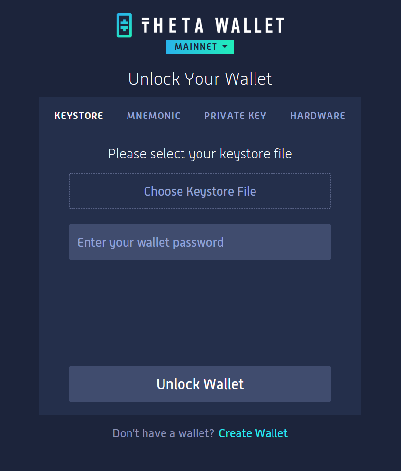
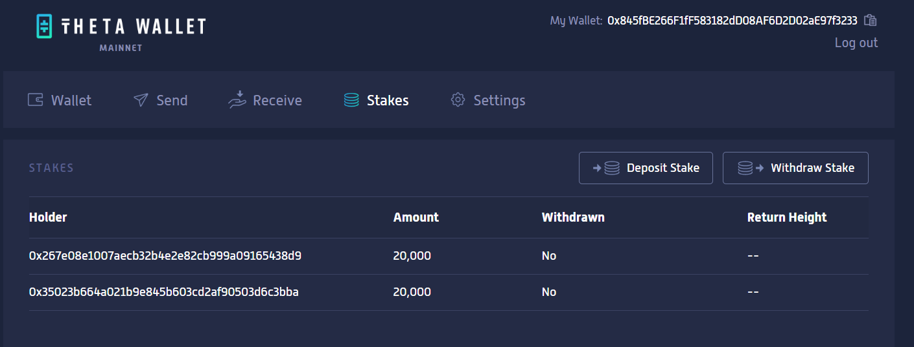
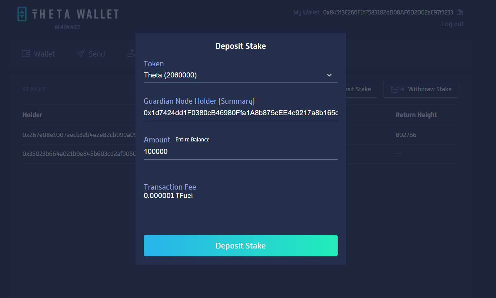
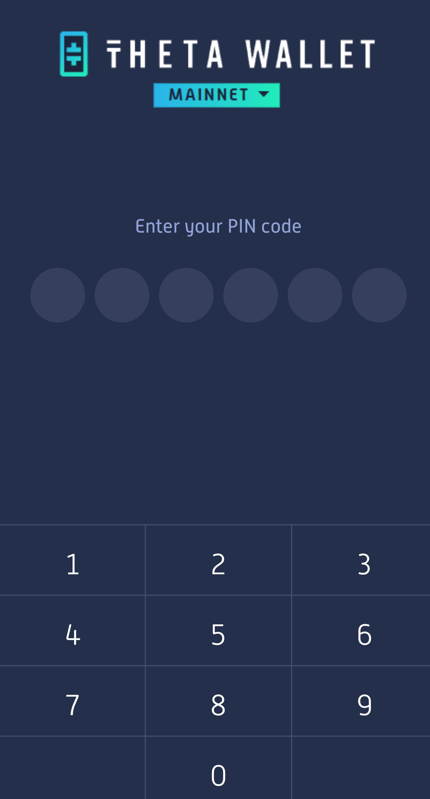
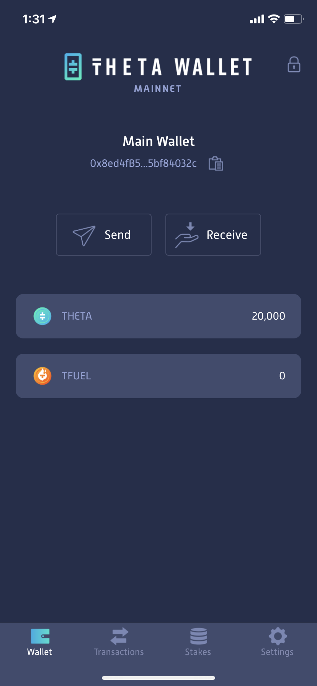
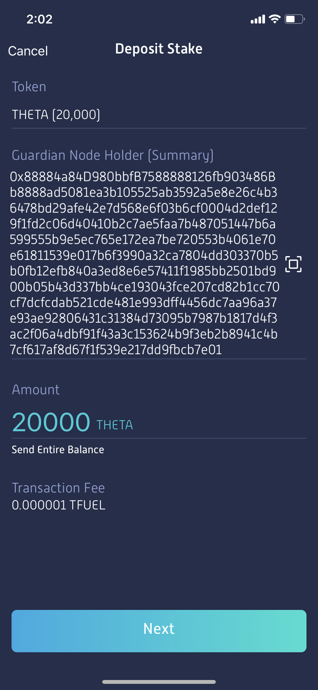

# Delegation Process

## Delegating Stake through Web Wallet

Access the [Theta Web Wallet](https://wallet.thetatoken.org) from your desktop/laptop. Unlock your Theta wallet using your typical access method (keystore, seed phrase, hardware wallet, etc.). 

<a href="url"></a>

Once your wallet is unlocked, click the “**Stakes**” tab of the menu and click “**Deposit Stake**”.

<a href="url"></a>

In the **Guardian Node Holder (Summary)** field, enter “**Summary**” text from GPooL Delegation page or Copy it from below.

```0x88884a84D980bbfB7588888126fb903486Bb8888ad5081ea3b105525ab3592a5e8e26c4b36478bd29afe42e7d568e6f03b6cf0004d2def129f1fd2c06d40410b2c7ae5faa7b487051447b6a599555b9e5ec765e172ea7be720553b4061e70e61811539e017b6f3990a32ca7804dd303370b5b0fb12efb840a3ed8e6e57411f1985bb2501bd900b05b43d337bb4ce193043fce207cd82b1cc70cf7dcfcdab521cde481e993dff4456dc7aa96a37e93ae92806431c31384d73095b7987b1817d4f3ac2f06a4dbf91f43a3c153624b9f3eb2b8941c4b7cf617af8d67f1f539e217dd9fbcb7e01```\
\
Enter the Amount of THETA you want to stake to this node and click “**Deposit Stake**". Note that you need to delegate **at least 10,000 THETA**.

<a href="url"></a>

After reviewing your delegated stake deposit info on the next screen, enter your wallet password, then click "**Confirm & Deposit Stake**".

**Important**: If you stake from a Nano Ledger wallet, you'd need to navigate to the Ethereum app, and make sure that in the settings, "Contract data Allowed" and "Debug data NOT Displayed" are selected.

## Delegating Stake through Mobile Wallet

Download the Theta Wallet app in the App Store / Play Store, or if already installed make sure  you have upgraded to version 2.0.0 (iOS) / 2.0.0 (Android).

<a href="url"></a>

Once your wallet is unlocked, click the “**Stakes**” tab at the bottom of the screen, then click “**Deposit**”.

<a href="url"></a>

In the **Guardian Node Holder (Summary)** field of the Theta Wallet app, click the **QR code icon** and use your device to scan the QR code from the GPooL Delegation page.

<a href="url"></a>

Then in the Wallet app enter the amount of THETA you want to stake to your Guardian Node and click “**Next**". Note that you need to delegate **at least 10,000 THETA**.

<a href="url"></a>

Wait to make sure the stake deposit transaction is confirmed.
